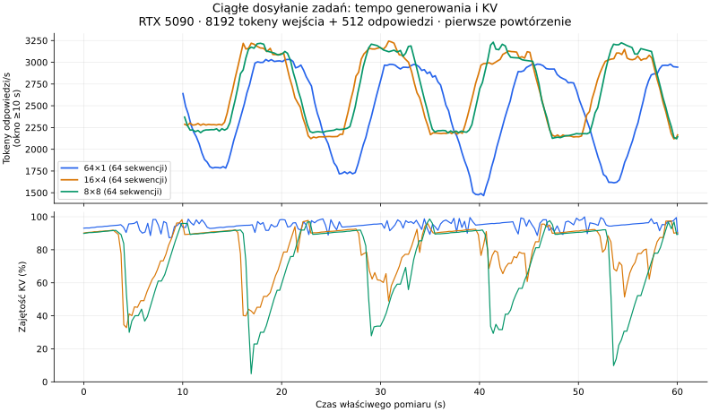

# vLLM: lista promptów a równoległe żądania HTTP

Test z 15 września 2026 porównuje `/v1/completions` przy `n=1`:
jedno żądanie z listą promptów oraz równoległe żądania z jednym promptem.
Sprawdzamy osobno grupy 64 i 80 sekwencji.

## Wniosek praktyczny

Dla tego profilu wybieramy **8 równoległych żądań, każde z 8 promptami**,
z natychmiastowym dosyłaniem następnej paczki po odebraniu odpowiedzi.
To 64 prompty w toku przy limicie silnika 80. **16×4 daje praktycznie taki
sam wynik**: różnica średnich wynosi 0.15%. Wybór 8×8 oznacza połowę liczby
równoległych HTTP i niższe średnie zajęcie KV niż przy 16×4.

8×8 osiąga **2625 tokenów odpowiedzi/s zbiorczo**, ze szczytem
**3235 t/s** w oknie co najmniej 10 sekund. KV zajmuje średnio
**73.6%**, a maksymalnie w próbkach **99.8%**. W obu
potwierdzających pomiarach nie było preemption. Przewaga przepustowości
nad 64×1 wynosi około **1.8%**.

Większe pule 80, 96 i 128 nie dały większej przepustowości w badanych próbach;
zwiększały głównie kolejkę i nacisk na KV. Zajęcie całego cache nie jest celem
samym w sobie. Wartość `max_num_seqs=80` pozostaje limitem serwera, a wielkość
puli i paczki ustala klient.

Wynik dotyczy lokalnego `/v1/completions`, bez streamingu, przy 8192 tokenach
wejścia i 512 tokenach odpowiedzi na prompt. Dla rzeczywistych, różnych długości
odpowiedzi JSON optimum może być inne. Nie jest to uniwersalne maksimum RTX 5090.

## Warunki pomiaru

Produkcja: RTX 5090, vLLM 0.29.0, Model Runner V2, Triton attention,
FlashInfer CUTLASS MoE, FP8 KV, MTP ×4, utilization 0.92,
`max_num_seqs=80`, `max_num_batched_tokens=8192`, kontekst 32768, 450 W.
Test korzysta z działającego kontenera bez zmiany konfiguracji.

W porównaniu pojedynczych grup każdy prompt ma 8192 tokeny, w tym wspólny
początek długości 6152 tokenów.
Każda odpowiedź ma dokładnie 512 tokenów; EOS jest ignorowany, `temperature=0`. To pomiar
przepustowości dla ustalonej ilości pracy, a nie jakości długich odpowiedzi JSON.
Osobna próba sprawdza JSON Schema, zakończenie generacji i przyporządkowanie
identyfikatora rekordu do każdego promptu.

- Połączenie z API przez loopback wewnątrz kontenera; bez Cloudflare i Internetu.
- Odpowiedzi bez streamingu. Czas grupy kończy się po odebraniu i odczytaniu
  JSON ostatniej odpowiedzi HTTP, przed sprawdzaniem jej zawartości.
- Trzy powtórzenia każdego wariantu, ze zmienną kolejnością, po rozgrzewce.
- Każda grupa używa własnej puli połączeń; błędy nie są ponawiane.
- Pary używają identycznych promptów, sprawdzanych przez SHA-256. Pierwsze
  64 prompty grupy 80 są identyczne z odpowiednią grupą 64.
- Osobny `cache_salt` dla każdego wariantu izoluje wcześniejsze trafienia
  bez czyszczenia produkcyjnego cache. W obrębie grupy salt jest wspólny.
- **Zimny prefiks:** brak przygotowania przed grupą; ponowne użycie w obrębie
  samej grupy nadal działa.
- **Przygotowany prefiks:** wcześniej przetworzono dokładnie pierwsze 6144
  tokeny i wygenerowano 32 tokeny w tej samej przestrzeni cache. Czas tego
  przygotowania nie wchodzi do czasu grupy, więc nie jest to pomiar oszczędności
  całego procesu od zera.
- Metryki cache i preemption to różnice liczników serwera, a maksymalna liczba
  aktywnych sekwencji i zajętość KV pochodzą z próbkowania co 250 ms.

## Wyniki pojedynczych grup

Mediany trzech pomiarów. `t/s` oznacza sumę tokenów odpowiedzi wszystkich
sekwencji podzieloną przez czas zakończenia całej grupy.

| Sekwencje | Prefiks | 1 HTTP z listą: czas / t/s | Osobne HTTP: czas / t/s | Skrócenie czasu osobnymi HTTP |
|---|---|---:|---:|---:|
| 64 | zimny | 13.42 s / 2442 | 12.49 s / 2624 | 6.9% |
| 64 | przygotowany | 13.10 s / 2502 | 12.01 s / 2729 | 8.3% |
| 80 | zimny | 18.85 s / 2173 | 17.61 s / 2326 | 6.6% |
| 80 | przygotowany | 18.76 s / 2184 | 17.44 s / 2349 | 7.0% |

Wszystkie 1728 sekwencji w mierzonych grupach zakończyły się poprawnie:
768 w grupach 64 i 960 w grupach 80. Osobne testy JSON zaliczyły łącznie
288/288 odpowiedzi z poprawnym schematem i identyfikatorem rekordu.

- **64:** oba sposoby osiągnęły 64 aktywne sekwencje, zero preemption;
  szczyt KV w próbkach wyniósł 98,18%. Trafienia prefiksu: 72,28% na zimno
  i 74,61% po przygotowaniu, identycznie dla obu sposobów wysyłania.
- **80:** maksymalnie 68–69 aktywnych sekwencji w próbkach, mimo 80 zadań
  w toku; wystąpiło łącznie jedno preemption. Średnie trafienia prefiksu:
  69,95% / 69,64% na zimno i 71,81% po przygotowaniu.
- Przy tych długościach kontekstu grupa 80 ma niższą przepustowość niż 64.
  Więcej zadań po stronie klienta nie oznacza automatycznie więcej pracy GPU
  wykonywanej jednocześnie.

To pomiar HTTP wraz z obsługą żądania i generacją. Nie przypisujemy całej
różnicy samym obliczeniom GPU. Nie obejmuje też kosztów sieci i tunelu.

### Próby ponownego użycia cache po zakończeniu żądania

Dla pojedynczych żądań z 8192 tokenami wejścia sprawdziliśmy odpowiedzi długości
1 oraz 32 tokenów. W obu długościach powtórzyło się następujące zachowanie:

| Kolejność | Trafienia w drugim żądaniu | Trafienia po ponownym wysłaniu drugiego |
|---|---:|---:|
| Pełny rekord A → inny rekord B, wspólny początek 6152 tokeny | 0 | 6112 |
| Różne rekordy z różnicą na początku | 0 | 0 |
| Dokładny prefiks 6144 tokeny → pełny rekord B | 6112 | 6112 |

To potwierdza współdzielenie między osobnymi HTTP, ale również ograniczenia:
nie należy zakładać pełnego trafienia tylko dlatego, że tekst był wcześniej
wysłany. Kod zarządzania KV uwzględnia zgodność wszystkich grup, granice bloków
i zatrzymywanie wybranych stanów warstw z przesuwającym się oknem. Nie
wyizolowaliśmy, który z tych mechanizmów odpowiada za każde zerowe trafienie.
Nie zmienialiśmy polityki przechowywania cache w ramach tego testu.

## Ciągłe uzupełnianie zadań

Drugi test utrzymuje pulę 64 lub 80 pojedynczych żądań HTTP. Kolejna macierz
sprawdza także kilka równoległych żądań, każde z kilkoma promptami. Po zakończeniu
każdego żądania natychmiast wysyła kolejne. Prompty pochodzą z banku 1024 różnych
rekordów, przygotowanego przed pomiarem; mają wspólny początek i takie same
8192 tokeny wejścia oraz 512 tokenów odpowiedzi jak w teście grup.

Każda faza ma 20 sekund rozgrzewki i 60 sekund właściwego pomiaru. Dopiero
potem zatrzymujemy dosyłanie i czekamy na pozostałe odpowiedzi. Są dwa
powtórzenia w kolejności 64/80 oraz 80/64, z odrębnymi przestrzeniami cache.

Tempo generowania w stałym obciążeniu to przyrost serwerowego licznika
`generation_tokens_total` podzielony przez rzeczywisty czas pomiaru. Obejmuje
wyłącznie tokeny odpowiedzi; tokenów promptu ani odrzuconych propozycji MTP
nie dodajemy do tego wyniku.
Najwyższe tempo liczymy w oknach trwających co najmniej 10 sekund. Nie jest to
teoretyczny limit karty ani wynik dla dowolnego modelu i długości kontekstu.
Zajętość KV i liczby zadań próbkujemy co 250 ms; średnie są ważone czasem.

Wstępna macierz grupowania testuje 32×2, 40×2, 16×4, 20×4, 8×8, 10×8,
4×16 i 5×16 (liczba równoległych HTTP × prompty w jednym HTTP). Każdy wariant
ma 15 sekund rozgrzewki i 30 sekund pomiaru. To etap wyboru kandydatów;
krótkiego maksimum nie traktujemy jako potwierdzonej przewagi.

Dodatkowa kontrola porównuje całkowity przyrost licznika generacji, łącznie
z rozgrzewką i końcowym opróżnieniem kolejki, z sumą tokenów ze wszystkich
odebranych odpowiedzi. Nie doliczamy końcowego opróżniania kolejki do tempa
ustabilizowanej pracy.

### Stała pula pojedynczych żądań

Średnie z dwóch 60-sekundowych pomiarów; szczyty to najwyższa obserwacja.
Bank ciągłego testu ma wspólny początek długości 6150 tokenów.

| Pula HTTP × prompty | Średnio output t/s | Najlepsze 10 s | KV średnio / szczyt | Aktywne średnio / maks. | Oczekujące średnio | Preemption w pomiarach |
|---|---:|---:|---:|---:|---:|---:|
| 64×1 | 2564 | 3096 | 94.66% / 99.97% | 61.0 / 64 | 1.0 | 1 |
| 80×1 | 2532 | 3082 | 95.95% / 99.98% | 61.9 / 67 | 16.3 | 7 |

Pula 80 zwiększyła głównie liczbę oczekujących zadań. Przy tym obciążeniu
nie uzyskała większej przepustowości niż 64. Wszystkie 1641 sekwencji,
łącznie z rozgrzewką i końcowym opróżnieniem, przeszły walidację liczby tokenów;
przyrosty serwerowego licznika generacji zgodziły się dokładnie z odpowiedziami.

### Wstępna macierz wielkości paczek

Jeden pomiar po 30 sekund na wariant, po 15 sekundach rozgrzewki.
Kolejność poniżej jest rankingiem tej krótkiej próby, a nie końcowym wyborem.

| HTTP × prompty | Sekwencje w toku | Output t/s | KV średnio / maks. | Aktywne średnio / maks. | Preemption |
|---|---:|---:|---:|---:|---:|
| 16×4 | 64 | 2673 | 80.7% / 95.1% | 53.7 / 64 | 0 |
| 8×8 | 64 | 2639 | 78.7% / 99.4% | 52.3 / 64 | 0 |
| 32×2 | 64 | 2490 | 88.8% / 98.6% | 58.9 / 64 | 0 |
| 4×16 | 64 | 2451 | 72.0% / 96.8% | 47.6 / 64 | 0 |
| 5×16 | 80 | 2356 | 87.5% / 99.9% | 57.3 / 68 | 0 |
| 20×4 | 80 | 2351 | 92.6% / 99.8% | 60.4 / 67 | 0 |
| 10×8 | 80 | 2311 | 87.4% / 99.9% | 57.2 / 67 | 1 |
| 40×2 | 80 | 2277 | 95.2% / 99.7% | 61.4 / 66 | 0 |

Wielkość paczki zmienia również równomierność pracy: przy paczkach część
sekwencji kończy się, zanim klient odbierze komplet wyników i dośle następną
paczkę. Mniejsze średnie zajęcie KV nie oznacza automatycznie mniejszej
przepustowości. Metryka KV dotyczy zajętych bloków; zwolnione bloki mogą nadal
zawierać prefiks do ponownego użycia, dopóki nie zostaną nadpisane.

Najlepszą wielkością paczki w tej macierzy były cztery prompty. Dla niej
kolejny etap sprawdza łącznie 32, 48, 96 i 128 promptów w toku, przy niezmienionym
limicie serwera `max_num_seqs=80`. Większe pule klienta mogą tworzyć kolejkę.

### Zmiana liczby zadań przy paczkach po cztery prompty

Ponownie 15 sekund rozgrzewki i 30 sekund pomiaru na wariant.

| HTTP × prompty | Sekwencje w toku | Output t/s | KV średnio / maks. | Aktywne średnio / maks. | Oczekujące średnio | Preemption |
|---|---:|---:|---:|---:|---:|---:|
| 8×4 | 32 | 2200 | 41.7% / 56.9% | 27.0 / 32 | 0.8 | 0 |
| 12×4 | 48 | 2778 | 62.7% / 76.0% | 41.6 / 48 | 0.9 | 0 |
| 24×4 | 96 | 2298 | 95.1% / 99.2% | 61.4 / 67 | 22.9 | 0 |
| 32×4 | 128 | 2280 | 95.0% / 99.9% | 60.9 / 67 | 56.1 | 1 |

Najlepszym kandydatem po tych próbach jest 48 sekwencji. Kolejny etap porównuje
przy tej liczbie paczki po 1, 2, 8 i 16 promptów; paczkę po cztery sprawdzono
powyżej. Większa liczba zadań w toku (96, 128) zwiększa głównie kolejkę.

### Grupowanie przy 48 sekwencjach

Uzupełniający pomiar po 30 sekund (15 sekund rozgrzewki). Wynik 12×4 pochodzi
z poprzedniej serii; dwa najlepsze warianty wybieramy do dłuższego potwierdzenia.

| HTTP × prompty | Output t/s | KV średnio / maks. | Aktywne średnio / maks. | Preemption |
|---|---:|---:|---:|---:|
| 48×1 | 2775 | 69.4% / 77.9% | 46.6 / 48 | 0 |
| 24×2 | 2732 | 64.9% / 79.4% | 43.3 / 48 | 0 |
| 6×8 | 2748 | 57.4% / 75.9% | 37.8 / 48 | 0 |
| 3×16 | 2608 | 54.6% / 75.9% | 35.8 / 48 | 0 |

Do końcowego porównania wybrano **12×4** i **48×1**, z kontrolą **64×1**.
Każdy wariant ma dwa powtórzenia po 20 sekund rozgrzewki i 60 sekund pomiaru;
drugi przebieg odwraca kolejność wariantów. W całym poszukiwaniu porównaliśmy
18 różnych kombinacji liczby HTTP i promptów w HTTP. To poszukiwanie w
określonym zbiorze ustawień, a nie dowód globalnego maksimum wydajności GPU.

### Podstawa końcowego wyboru

Dłuższe próby nie potwierdziły przewagi 48 sekwencji z krótkiego rankingu:
48×1 i 12×4 osiągnęły około 2510 t/s, a kontrola 64×1 około 2579 t/s.
Dlatego do dłuższego sprawdzenia dołączono również najlepsze wstępne paczki
przy 64 sekwencjach: 16×4 i 8×8.

Obie serie potwierdzające stosują 20 sekund rozgrzewki, 60 sekund pomiaru
i dwa powtórzenia z odwróconą kolejnością. Krótkie próby miały inną rozgrzewkę
oraz krótsze okno pomiaru; ich rankingu nie traktujemy jako końcowego wyniku.
Bank promptów we wszystkich seriach ciągłych ma identyczny SHA-256.

### Wyniki końcowe: jednakowe, dłuższe pomiary

Średnie ważone czasem dwóch 60-sekundowych pomiarów. Zakres podaje wyniki
poszczególnych powtórzeń. Szczyt obejmuje co najmniej 10 sekund.

| HTTP × prompty | Output t/s | Zakres powtórzeń | Szczyt ≥10 s | KV średnio / maks. | Preemption |
|---|---:|---:|---:|---:|---:|
| 16×4 | 2629 | 2626–2632 | 3244 | 81.3% / 99.7% | 0 |
| 8×8 | 2625 | 2623–2627 | 3235 | 73.6% / 99.8% | 0 |
| 64×1 | 2579 | 2578–2580 | 3055 | 94.9% / 99.9% | 3 |
| 48×1 | 2510 | 2508–2512 | 2774 | 69.6% / 80.4% | 0 |
| 12×4 | 2509 | 2503–2514 | 2826 | 62.4% / 80.2% | 0 |

| HTTP × prompty | Aktywne sekwencje średnio / maks. | Oczekujące średnio |
|---|---:|---:|
| 8×8 | 48.6 / 64 | 5.9 |
| 16×4 | 53.9 / 64 | 2.0 |
| 64×1 | 61.2 / 64 | 1.0 |
| 48×1 | 46.7 / 48 | 0.1 |
| 12×4 | 40.9 / 48 | 0.7 |

Powyższe konfiguracje były mierzone kolejno. Średnie z obu powtórzeń są
podstawą porównania; wykres pokazuje pierwsze powtórzenie trzech wariantów
z 64 promptami w toku.

## Sekwencje, sloty i HTTP

vLLM rozdziela listę promptów na osobne zadania silnika. Limit 80 dotyczy
aktywnych sekwencji; przy `n=1` zarówno lista 80 promptów, jak i 80 pojedynczych
żądań dostarczają 80 sekwencji. Nie gwarantuje to identycznego momentu ich
przyjęcia, czasu odpowiedzi ani zmieszczenia dowolnych kontekstów w KV.
[Implementacja endpointu](https://github.com/vllm-project/vllm/blob/v0.29.0/vllm/entrypoints/openai/completion/serving.py).

80 było zachowanym ustawieniem podczas testów migracji. Nie wyliczyliśmy go
jako udowodnionego optimum i nie przeprowadziliśmy tutaj porównania różnych
wartości `max_num_seqs`. Zmieniamy liczbę zadań dostarczanych przez klienta.

## Jak działa wybór prefiksu

Klient układa stałe instrukcje i wspólne dane przed zmiennymi danymi rekordu.
Serwer automatycznie dopasowuje tokeny od początku, z uwzględnieniem granic
bloków i dostępności cache. Nie trzeba wstawiać w tekście znacznika końca cache.
Identyczny fragment po wcześniejszej różnicy nie jest wspólnym prefiksem.
[Opis APC](https://docs.vllm.ai/en/v0.29.0/design/prefix_caching/).

W Gemmie muszą zgadzać się warunki ponownego użycia dla wszystkich grup
warstw uwagi. Warstwy z przesuwającym się oknem mają inne wymagania niż
warstwy pełnej uwagi. Zapisanie całego promptu nie gwarantuje późniejszego
trafienia dla każdego jego krótszego prefiksu.
[Hybrydowy KV cache](https://docs.vllm.ai/en/v0.29.0/design/hybrid_kv_cache_manager/).

## Kontrola metody: zachowany pilotaż

Pierwsza seria `http-batching-20260915` zakończyła się poprawnie, ale jej czas
obejmował ponowną tokenizację promptów podczas walidacji klienta. Dla jednej
listy 64 promptów dodawało to około 0,94 s po odbiorze odpowiedzi; dla osobnych
żądań duża część tego kosztu nakładała się na trwającą generację. Te czasy nie
służą do końcowego porównania. Poprawiony pomiar zapisuje czas odbioru odpowiedzi,
a długości promptów oblicza przed wysłaniem.

Pilotaż przygotowywał również prefiks zakończony dodatkową instrukcją i tylko
jednym tokenem odpowiedzi. Nie poprawiało to trafień względem zimnej grupy.
Końcowa metoda używa dokładnego prefiksu, a osobne próby cache zachowują także
wyniki z jednym tokenem odpowiedzi. Surowe wyniki pilotażu pozostają dostępne.

## Próba wyłączona z rankingu: dodatkowy ruch

Pierwsza seria `continuous-confirm64-20260915` została przerwana po kontroli
liczników: serwer naliczył **225280 tokenów**, a 109 odpowiedzi benchmarku
(436 sekwencji) zawierało **223232 tokeny**. Różnica wyniosła 2048.

Logi zawierają dokładnie 109 oczekiwanych wywołań `/v1/completions` oraz dwa
dodatkowe wywołania `/v1/chat/completions` w trakcie obciążenia. Weryfikacje
przed/po serii są oddzielnymi wpisami. Wszystkie odpowiedzi benchmarku były
poprawne, ale wynik 2613,5 t/s z tej próby nie służy do rankingu.

Powtórzenie ma odrębny identyfikator `continuous-confirm64-repeat-20260915`.
Na jego czas zatrzymano publiczny tunel, pozostawiając benchmark wewnątrz
kontenera; kontroler przywraca tunel w `finally` przed weryfikacją usługi.
Pierwotne wyniki i logi pozostają zachowane. W pozostałych zaliczonych seriach
przyrosty generacji były zgodne z sumą odebranych tokenów.

## Zakres końcowej walidacji

Zaliczono **30 faz ciągłych w 18 różnych konfiguracjach**: 4990 odpowiedzi HTTP
obejmujących **9960 sekwencji**, łącznie z rozgrzewką i końcowym opróżnieniem.
Wszystkie te fazy miały zgodną liczbę tokenów po stronie serwera i klienta,
bez błędów odpowiedzi. Próba z dodatkowym ruchem została wyłączona z tych liczb.
Oddzielnie zaliczono opisane wyżej porównania grup i 288 odpowiedzi JSON.

Po ostatniej serii przywrócono publiczny tunel. Weryfikacja produkcji
(`deploy/server/verify.sh`) przeszła, w tym sprawdzenie lokalnego generowania,
publicznego dostępu i ustawień wdrożenia. Wynik pomiarów nie zmienia
konfiguracji silnika; zalecenie dotyczy sposobu wysyłania zadań przez klienta.

## Odtworzenie i artefakty

- [Porównanie grup HTTP](../benchmarks/reddit-matching/compare-http-batching.py).
- [Ciągłe obciążenie i dowolne grupowanie HTTP](../benchmarks/reddit-matching/continuous-http-load.py).
- [Instrukcja uruchamiania](../benchmarks/reddit-matching/README.md#http-grouping-and-continuous-load).
- [Zapisane metryki i sumy kontrolne](../benchmarks/reddit-matching/http-batching-results-20260915.json).

Surowe odpowiedzi, próbki metryk, logi i weryfikacja produkcji pozostają
w ignorowanym `benchmark-results/` lokalnie oraz w kopii repozytorium na serwerze.
Serie: `http-batching-20260915` (pilotaż), `http-batching-final-20260915`,
`http-batching-80-20260915`, `continuous-http-20260915`,
`continuous-grid-20260915`, `continuous-range-20260915`
`continuous-cross-20260915`, `continuous-confirm-20260915`
`continuous-confirm64-20260915` (wyłączona próba)
i `continuous-confirm64-repeat-20260915`.
